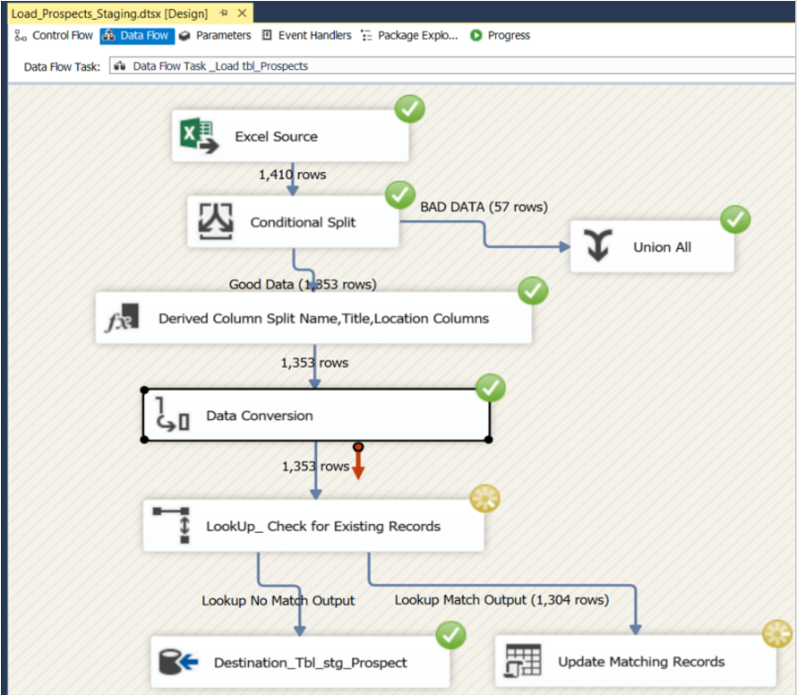

# SSIS-Data-Integration-Project

In this SSIS package:
- **Excel Source**: Loads data from an Excel file 
 **Create Target SQL Staging table**: Create Staging table in Datawarehouse,
- **Conditional Split**: Data cleaning, removing nulls and bad data to meet BRD requirements.
- **Lookups and Error Handling**: Checks for existing records and handles errors by logging them in files.

- **KPI Tracking**: Implements key performance indicators for monitoring response times.

## Key Components
- **Conditional Split**: Separates records into valid and error data.
- **Lookup Transformations**: Checks for existing data and updates records where needed.
- **Multicast**: Allows the data to flow into multiple paths simultaneously.
- **Error Handling**: Logs errors and outputs to a destination file for review.

## How to Run the Project

1. Import the SSIS package in SQL Server Data Tools.
2. Adjust connection strings to point to your data sources.
3. Execute the package and review the output logs.
